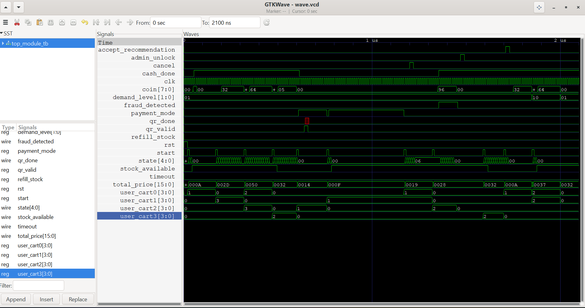
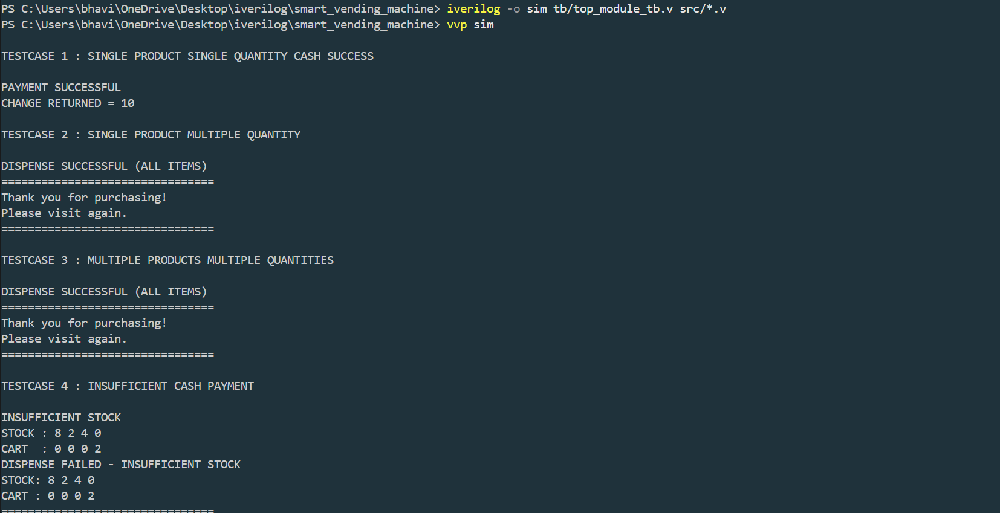
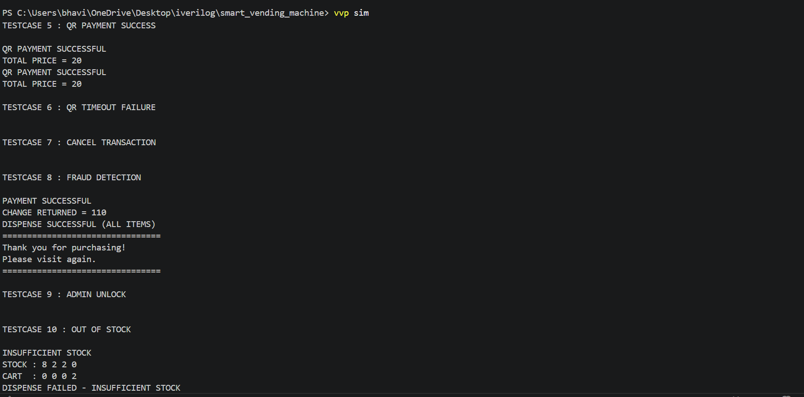

# Smart AI-Based Multi-Payment Vending Machine
##  Project Overview

Traditional vending machines provide only basic product dispensing. This project extends the functionality by incorporating modern smart features such as:

- Multi-product selection
- Multiple quantity purchases
- Cash payment handling
- QR payment processing
- Dynamic demand-based pricing
- Product recommendation engine
- Inventory monitoring
- Fraud detection and machine locking
- Timeout handling
- Transaction logging
- Admin maintenance control

The complete design is implemented using **Verilog HDL** and verified through simulation using **Icarus Verilog** and **GTKWave**.

##  System Architecture


```
### Major Modules

 Module                                           Function 

 Vending FSM                                      Controls overall machine operation 
 Cart Manager                                     Maintains selected products and quantities 
 Inventory Manager                                Checks and updates stock 
 Dynamic Pricing                                  Adjusts prices according to demand 
 Recommendation Engine                            Suggests related products 
 Payment Controller                               Handles cash transactions 
 QR Payment FSM                                   Handles QR payment flow 
 Fraud Detector                                   Detects suspicious activities 
 Timeout Controller                               Handles inactivity timeouts 
 Transaction Logger                               Records transaction information 
 Admin Controller                                 Unlocks and manages machine 
```

##  FSM Flowchart


```
### State Sequence

IDLE
 ↓
SELECT_PRODUCT
 ↓
CHECK_STOCK
 ↓
DYNAMIC_PRICING
 ↓
RECOMMENDED_PRODUCT
 ↓
SELECT_PAYMENT
 ↓
INSERT_CASH / GENERATE_QR
 ↓
VERIFY_PAYMENT
 ↓
PAYMENT_SUCCESS
 ↓
DISPENSE_PRODUCT
 ↓
UPDATE_INVENTORY
 ↓
GENERATE_RECEIPT
 ↓
TRANSACTION_LOG
 ↓
UPDATE_HISTORY
 ↓
IDLE
```

##  Payment Modes

### Cash Payment

- Coin insertion
- Running balance calculation
- Change return calculation
- Payment verification

### QR Payment

- QR generation
- Payment validation
- Timeout monitoring
- Fraud detection integration

```
##  Inventory Management
Initial stock:

 Product        Stock 

 Product 0       10 
 Product 1       5 
 Product 2       7 
 Product 3       0 

Features:

- Real-time stock checking
- Stock deduction after dispensing
- Out-of-stock handling
```

```
## Recommendation Engine

The recommendation engine suggests complementary products based on user selections.

Example:

Selected Product  Suggested Product 

 Product 0           Product 1 
 Product 1           Product 0 
 Product 2           Product 3 
 Product 3           Product 2 
```

```
## Dynamic Pricing

Prices are adjusted according to demand.

 Demand Level       Price Adjustment 

  Low Demand         10% Discount 
  Normal Demand      Standard Price 
  High Demand        10% Increase
```

##  Fraud Detection

The machine monitors suspicious activities such as:

- Invalid QR transactions
- Payment inconsistencies
- Security violations

Upon detection:
LOCK_MACHINE State Activated

The machine remains locked until an administrator unlocks it.


##  Timeout Handling

Transactions are automatically cancelled when:

- User inactivity exceeds the timeout period
- QR payment takes too long

This prevents system hanging and improves reliability.

## Transaction Logging

Records:

- Total transactions
- Transaction amount
- Payment status
- Transaction history

##  Test Cases Implemented

### Functional Tests

✅ Single Product – Single Quantity

✅ Single Product – Multiple Quantity

✅ Multiple Products – Multiple Quantities

### Payment Tests

✅ Cash Payment Success

✅ Cash Payment Failure

✅ QR Payment Success

✅ QR Timeout

### Security Tests

✅ Fraud Detection

✅ Admin Unlock

### Inventory Tests

✅ Out of Stock Handling

### Smart Features

✅ Recommendation Acceptance

✅ Dynamic Pricing


##  Simulation Results

### Sample Waveform



Observed Signals:

- state
- total_price
- cash_done
- qr_done
- fraud_detected
- timeout
- stock_available

```
##  Tools Used

  Tool               Purpose 
  Verilog HDL        RTL Design 
 Icarus Verilog      Simulation 
  GTKWave            Waveform Analysis 
  VS Code            Development 
 GitHub              Version Control 
```

##  How to Run

### Compile

powershell
iverilog -o sim tb/top_module_tb.v src/*.v

### Simulate
powershell
vvp sim

### View Waveforms

powershell
gtkwave wave.vcd

``` 
##  Repository Structure

smart_vending_machine/
│
├── src/
│   ├── top_module.v
│   ├── vending_fsm.v
│   ├── inventory_manager.v
│   ├── cart_manager.v
│   ├── payment_controller.v
│   ├── qr_payment_fsm.v
│   ├── recommendation_engine.v
│   ├── dynamic_pricing.v
│   ├── fraud_detector.v
│   ├── timeout_controller.v
│   ├── admin_controller.v
│   ├── transaction_logger.v
│
├── tb/
│   ├── top_module_tb.v
│  
├── docs/
│   ├── BLOCK_DIAGRAM_VM.png
│   ├── FSM_VM.png
│   ├── WAVEFORM_VM.png
│   ├── TESTCASE1_VM.png
│   ├── TESTCASE_2_VM.png
│   ├── TESTCASE3_VM.png
│   └── Smart_Vending_Machine_Project_Report.pdf
│
├── README.md
└── .gitignore
```


# Testbench Results






##  Future Enhancements

- Real-time analytics
- Voice interaction
- Touchscreen interface
- OTP-based admin access

## Author

Bhavitha Nagavarapu

Project: Smart AI-Based Multi-Payment Vending Machine using Verilog HDL
## References

1. Verilog HDL – Samir Palnitkar
2. Digital Design – Morris Mano
3. Icarus Verilog Documentation
4. GTKWave Documentation

## Project Highlights

✔ Modular RTL Design

✔ 20-State Finite State Machine

✔ Dual Payment Support

✔ Dynamic Pricing

✔ Recommendation Engine

✔ Fraud Detection

✔ Inventory Tracking

✔ Transaction Logging

✔ Fully Simulated and Verified